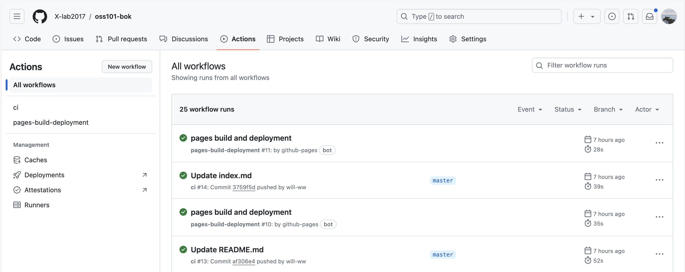

# oss101-bok
**[《开源软件通识：知识体系指南》](https://www.x-lab.info/oss101-bok/)**  

开源是全球范围内科技创新、产业协作、资源重组的重要路径，对于推动经济发展、科技创新、文化繁荣、开放合作有重要作用。从 2021 年开始，中国电子技术标准化研究院积极推动国际国内开源标准化工作，并于 2023 年底发布了全国首套[开源治理系列团体标准](https://github.com/kaiyuanshe/ONES/wiki)。

为了更好的推广与应用本套开源治理系列标准，特编写本《开源软件通识：知识体系指南》一书，对标准中出现的重要概念、术语与定义进行详细解读，进而形成开源领域的知识体系。同时，在编写的过程中，也会补充重要，但没有出现在开源治理系列标准中的概念、术语和定义，以形成一个覆盖完整、具有结构化知识体系的开源通识读物。

<div align=center>

</div>

# 贡献指南
> 为了更好地管理仓库，我们建议贡献者通过Fork的方式进行修改，然后提交Pull Request以完成贡献。
1. 克隆仓库
   1. Fork本仓库到自己的GitHub账号
   2. 也可以页面中的点击“编辑图标”，如果遇到“需要 Fork 此仓库”的提示，请同意该操作。
        <div align=center>
            
        </div>
   3. 克隆自己Fork的仓库到本地
2. 创建分支
    1. 在开始之前，为你的贡献创建一个新的分支  
    `git checkout -b 分支名字`
3. 开发和测试
    1. 在文件目录`docs/textbook`下的文件夹中找到所需要修改的章节以及相应的Markdown文件，修改内容
    2. 如果是添加新的章节和内容，在`docs/textbook`下创建新的文件夹或相应的文件夹中，创建新的`.md`文件，撰写您的内容。
    3. 如果是添加了新的`.md`文件的方式，或者想对书籍的目录名称进行修改，找到`mkdocs.yml`文件中的nav部分，模仿下面的模版，添加相应的内容或修改
        ```
        nav:
          - 首页: index.md
          - 教材:
            - 开源软件通识：知识体系指南:
                - 第 1 章 开源知识体系:
                  - 1.1 背景与目标: textbook/chapter_1/chapter_1_1. md
                  - 1.2 知识体系与框架: textbook/chapter_1/ chapter_1_2.md
                  - 1.3 本书组织与结构: textbook/chapter_1/ chapter_1_3.md
        ```
    4. 效果测试。如果需要对您的修改效果进行实时查看，请参考如下步骤：
       1. 本文档网站基于`MkDocs`进行构建，使用`Material for MkDocs`主题。首先要确保您的相关环境是否安装，若没安装可以参考下面如下语句：
            ```
            pip install mkdocs-material
            ```
       2. MkDocs包含一个实时预览的服务，所有可以在撰写文档的过程中进行实时预览。当文档修改保存后，这个服务会自动重建整个网站的文档。使用以下命令启动：
            ```
            mkdocs serve
            ```
            浏览器打开 [localhost:8000](http://127.0.0.1:8000) ，应该就能看到类似下图所示的内容：
            <div align=center>
                
            </div>
4. 提交更改
   1. 将本地所做更改`commit`
   2. `push`至远程仓库。
5. 创建`Pull Request`
    1. 在Github仓库网页中创建`Pull Request`
    2. 项目维护者将审核你的`Pull Request`，一旦你的贡献通过审查，它将被合并到主分支在。合并到主分支后，仓库的`workflow`会自动更新部署网站，在等待几十秒后，如图所示后，刷新网站，即可看到网站更新内容
        <div align=center>
            
        </div>
